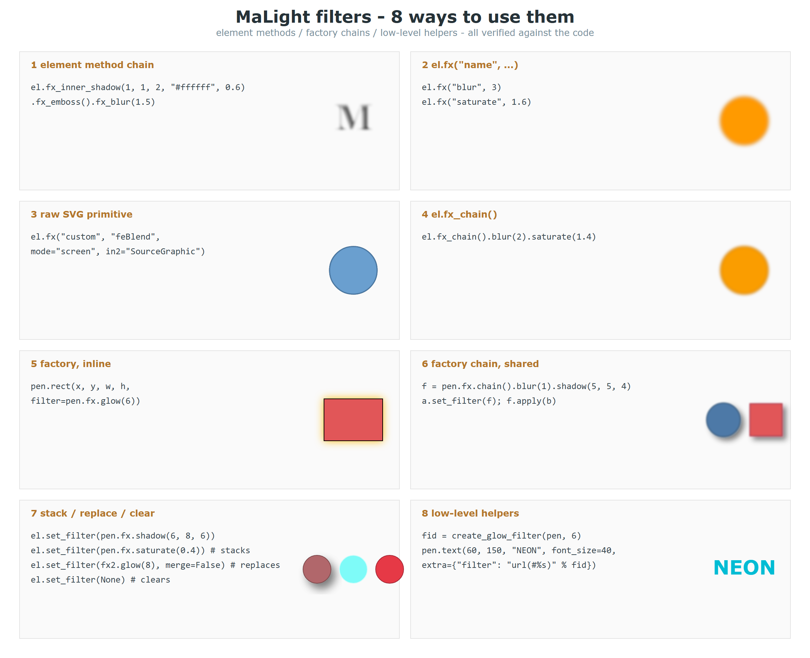

<!-- Generated by tools/gen_docs.py from the source docstrings.
     Do not edit by hand: edit the docstrings in filters.py and re-run. -->

# filters.py

[简体中文](filters.zh.md) ｜ **English** ｜ [← Back to README](../../README.en.md)

The filter factory behind pen.fx and pen.filter.

Every way to use filters (8 styles; they stack and can be shared). See
`assets/images/filters_preview.png` for the illustrated version - 8 cards,
code on the left, rendered result on the right.

**1. Element method chain (recommended - `fx_*` returns the element, so it chains forever)**

```python
el.fx_inner_shadow(1, 1, 2, "#ffffff", 0.6).fx_emboss().fx_blur(1.5)
```

**2. Stack an effect by name (same as `el.fx_blur(3)`)**

```python
el.fx("blur", 3)
```

**3. Append any raw SVG filter primitive**

```python
el.fx("custom", "feBlend", mode="screen", in2="SourceGraphic")
```

**4. Continue the chain already bound to the element**

```python
el.fx_chain().blur(2).saturate(1.4)
```

**5. Factory, one call (most common - pass `filter=` straight in)**

```python
pen.circle(500, 300, 120, fill_color="#4e79a7",
           filter=pen.fx.shadow(6, 8, 6))
```

**6. Factory chain, then bind it (one chain can be shared by many elements)**

```python
f = pen.fx.chain().blur(1).shadow(5, 5, 4)
a.set_filter(f)                 # or the equivalent f.apply(a)
```

**7. Stack / replace / clear (`set_filter` stacks by default instead of overwriting)**

```python
el.set_filter(pen.fx.shadow(6, 8, 6))
el.set_filter(pen.fx.saturate(0.4))         # stacks, the shadow stays
el.set_filter(pen.fx.glow(8), merge=False)  # replaces the whole chain
el.set_filter(None)                         # clears it
```

**8. Low-level helpers (grab an id from `tools.create_*_filter`, attach via `extra`)**

```python
fid = create_glow_filter(pen, 6)
pen.text(60, 150, "NEON", extra={"filter": "url(#%s)" % fid})
```

The factory methods map one-to-one onto the element shortcuts
(`pen.fx.blur(x)` is the same as `el.fx_blur(x)`); `pen.filter` is an alias of
`pen.fx`.

Every method returns a `FilterChain` (carrying a `<filter>` node and its id) that you can
pass straight to an element's `filter` argument, or bind with `el.set_filter(f)` /
`f.apply(el)`.

This file contains a single class, `FilterAPI`.



---

## Classes and methods

### `FilterAPI`

FilterAPI - the filter factory.

| Method | Description |
|---|---|
| `chain(id_=None, pad=0.4)` | Start an empty filter chain and stack effects on it freely. |
| `blur(std_deviation=3, **kw)` | Gaussian blur. |
| `sharpen(amount=0.5, **kw)` | Sharpen, amount 0-1. |
| `motion_blur(distance=10, angle=0, **kw)` | Motion blur. |
| `shadow(dx=4, dy=4, blur=4, color='black', opacity=0.5, **kw)` | Drop shadow; a short alias of drop_shadow. |
| `drop_shadow(dx=3, dy=3, std_deviation=3, opacity=0.5, **kw)` | Drop shadow, kept for the older parameter names. |
| `inner_shadow(dx=3, dy=3, blur=3, color='black', opacity=0.6, **kw)` | Inner shadow. |
| `glow(std_deviation=4, color='#ffb703', opacity=0.9, **kw)` | Outer glow. |
| `inner_glow(blur=5, color='#ffd166', opacity=0.9, **kw)` | Inner glow. |
| `bevel(strength=1.0, blur=2, azimuth=225, elevation=55, **kw)` | Bevel and emboss, like the Photoshop layer style. |
| `engrave(depth=1.2, blur=1, dark='#3E2410', light='#FFFDF5', **kw)` | Engrave, the opposite of a raised bevel. |
| `outline(width=3, color='gold', **kw)` | Outer stroke growing outwards along the outline. |
| `roughen(scale=4, frequency=0.05, **kw)` | Roughen for a hand-drawn feel. |
| `noise(opacity=0.15, **kw)` | Grainy noise overlay. |
| `emboss(azimuth=45, **kw)` | Grayscale emboss. |
| `edge_detect(width=1, **kw)` | Edge detection for a line-art look; width above 1 thickens the strokes. |
| `saturate(factor=1.2, **kw)` | Saturation. |
| `hue_rotate(degrees=90, **kw)` | Hue rotation. |
| `grayscale(**kw)` | Desaturate to grayscale. |
| `sepia(**kw)` | Sepia tone. |
| `brightness(factor=1.2, **kw)` | Brightness. |
| `contrast(factor=1.3, **kw)` | Contrast. |
| `gamma(r=1.0, g=1.0, b=1.0, **kw)` | Gamma correction. |
| `invert(**kw)` | Invert colors. |
| `posterize(levels=4, **kw)` | Posterize; fewer levels means flatter color blocks. |
| `color_overlay(color='red', opacity=0.8, **kw)` | Color overlay. |

---

## Sibling modules

[containers](containers.en.md) ｜ [core](core.en.md) ｜ [debug](debug.en.md) ｜ [effects](effects.en.md) ｜ [fx](fx.en.md) ｜ [gradients_mixin](gradients_mixin.en.md) ｜ [images](images.en.md) ｜ [layout](layout.en.md) ｜ [paths](paths.en.md) ｜ [repeat](repeat.en.md) ｜ [shapes](shapes.en.md) ｜ [style](style.en.md) ｜ [text_board](text_board.en.md)
