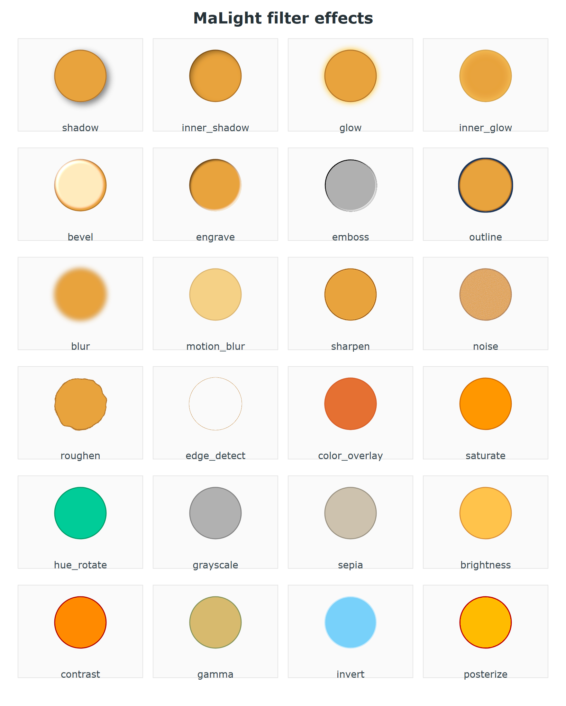

<!-- Generated by tools/gen_docs.py from the source docstrings.
     Do not edit by hand: edit the docstrings in fx.py and re-run. -->

# fx.py

[简体中文](fx.zh.md) ｜ **English** ｜ [← Back to README](../../README.en.md)

FilterChain, a chainable builder for Photoshop-style filter stacks.

One `FilterChain` maps to one SVG `<filter>` definition. Each effect method appends an SVG
filter primitive in call order (feGaussianBlur / feOffset / feFlood / feComposite /
feMerge / feColorMatrix / feComponentTransfer / feConvolveMatrix / feTurbulence /
feDisplacementMap / feMorphology / feSpecularLighting), and the output of the previous step
becomes the input of the next one - what you see is what you get.

Only effects that render identically and predictably in mainstream browsers (Chrome /
Firefox / Safari / Edge) are included; filters with unstable results are left out.

The elements carry shortcuts that mirror the factory one-to-one (`fx_*` returns the
element itself, so it chains forever):

```python
el.fx_inner_shadow(1, 1, 2, "#ffffff", 0.6).fx_emboss().fx_blur(1.5)
el.fx("blur", 3)                            # by name, same as el.fx_blur(3)
el.fx("custom", "feBlend", mode="screen")   # append a raw SVG primitive
el.fx_chain().blur(2).saturate(1.4)         # continue the element's own chain
```

All 8 ways to use filters are listed in the module docstring of
`malight/board/filters.py`, illustrated in `assets/images/filters_preview.png`.

This file contains a single class, `FilterChain`.



---

## Classes and methods

### Functions

| Function | Description |
|---|---|
| `count_refs` | Count how many drawn nodes reference this filter chain; used to decide whether the `<filter>` node can be recycled. |

### `FilterChain`

FilterChain - chainable filters, modelled on Photoshop layer styles plus filters.

| Method | Description |
|---|---|
| `url()` | Return the filter reference string "url(#id)". |
| `apply(el)` | Apply the filter to an element; equivalent to el.set_filter(f). |
| `clone(id_=None)` | Copy this chain, effects included, into an independent new one so another element can extend it on its own. |
| `merge_from(other)` | Stack another chain's effects onto the end of this one (internal). |
| `dispose()` | Remove this chain's `<filter>` from the board defs and unregister it (internal). |
| `blur(std_deviation=3)` | Gaussian blur, matching Photoshop's Gaussian Blur. |
| `sharpen(amount=0.5)` | Sharpen, a simplified Photoshop USM Sharpen, amount 0-1. |
| `motion_blur(distance=10, angle=0)` | Directional blur, like Photoshop's Motion Blur; distance up to about 15 works best. |
| `shadow(dx=4, dy=4, blur=4, color='black', opacity=0.5)` | Drop shadow. |
| `inner_shadow(dx=3, dy=3, blur=3, color='black', opacity=0.6)` | Inner shadow. |
| `glow(blur=5, color='#ffb703', opacity=0.9)` | Outer glow. |
| `inner_glow(blur=5, color='#ffd166', opacity=0.9)` | Inner glow. |
| `bevel(strength=1.0, blur=2, azimuth=225, elevation=55, light_color='white', surface=2.5)` | Bevel and emboss, covering the highlight half of the Photoshop effect. |
| `engrave(depth=1.2, blur=1, dark='#3E2410', light='#FFFDF5', dark_opacity=0.85, light_opacity=0.9)` | Engrave - the opposite of bevel: the top/left inner edge goes dark and the bottom/right inner edge catches the light, so the shape reads as carved into the surface. |
| `outline(width=3, color='gold')` | Outer stroke that expands outwards along the outline. |
| `roughen(scale=4, frequency=0.05, seed=None)` | Roughen for a hand-drawn look, implemented with turbulence displacement. |
| `noise(opacity=0.15, mono=True, seed=None)` | Grainy noise overlaid on the shape. |
| `emboss(azimuth=45)` | Grayscale emboss, like Photoshop's Stylize - Emboss. |
| `edge_detect(width=1)` | Edge detection producing line-art grayscale, like Photoshop's Find Edges. |
| `saturate(factor=1.2)` | Saturation: factor below 1 reduces it, above 1 increases it. |
| `hue_rotate(degrees=90)` | Hue rotation, shifting the whole palette like Photoshop's hue slider. |
| `grayscale()` | Desaturate, like Photoshop's Desaturate / Black and White. |
| `sepia()` | Warm sepia tone, like Photoshop's Photo Filter. |
| `brightness(factor=1.2)` | Brightness: factor below 1 darkens, above 1 brightens. |
| `contrast(factor=1.3)` | Contrast: factor below 1 reduces it, above 1 increases it. |
| `gamma(r=1.0, g=1.0, b=1.0)` | Gamma correction: above 1 lifts midtones, below 1 darkens them. |
| `invert()` | Invert colors. |
| `posterize(levels=4)` | Posterize: fewer levels produce flatter color blocks. |
| `color_overlay(color='red', opacity=0.8)` | Color overlay. |
| `custom(tag, **attribs)` | Append any raw SVG filter primitive, such as feBlend or feTile, so the chain stays extensible. |

---

## Sibling modules

[containers](containers.en.md) ｜ [core](core.en.md) ｜ [debug](debug.en.md) ｜ [effects](effects.en.md) ｜ [filters](filters.en.md) ｜ [gradients_mixin](gradients_mixin.en.md) ｜ [images](images.en.md) ｜ [layout](layout.en.md) ｜ [paths](paths.en.md) ｜ [repeat](repeat.en.md) ｜ [shapes](shapes.en.md) ｜ [style](style.en.md) ｜ [text_board](text_board.en.md)
