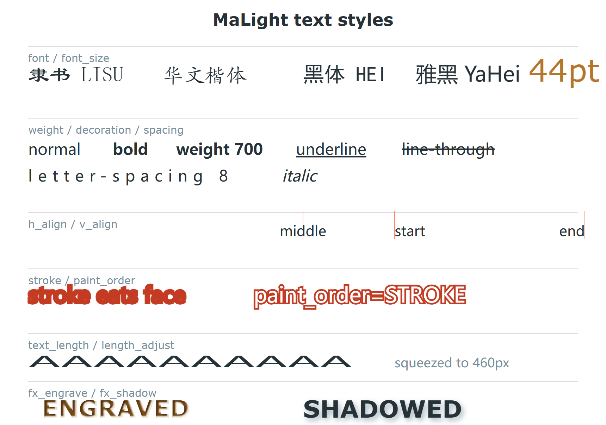

<!-- Generated by tools/gen_docs.py from the source docstrings.
     Do not edit by hand: edit the docstrings in text.py and re-run. -->

# text.py

[简体中文](text.zh.md) ｜ **English** ｜ [← Back to README](../../README.en.md)

TextElement, created by pen.text.



---

## Classes and methods

### `TextElement`

Text element.

| Method | Description |
|---|---|
| `set_text(value)` | Change the text content. |
| `get_text()` | Read the current text content. |
| `set_font(font)` | Change the font (enum, family name or font file). |
| `get_font()` | Read the current raw font-family attribute. |
| `set_font_size(size)` | Change the font size. |
| `get_font_size()` | Read the current raw font-size attribute. |
| `set_bold(flag=True)` | Turn bold on or off. |
| `get_bold()` | Read the current raw font-weight attribute. |
| `set_italic(flag=True)` | Turn italic on or off. |
| `get_italic()` | Read the current raw font-style attribute. |
| `set_underline(flag=True)` | Turn underline on or off. |
| `get_underline()` | Read the current raw text-decoration attribute. |
| `set_weight(weight)` | Set the font weight (FontWeight enum or "700"). |
| `get_weight()` | Read the current raw font-weight attribute. |
| `set_decoration(decoration)` | Set the text decoration (underline / line-through). |
| `get_decoration()` | Read the current raw text-decoration attribute. |
| `set_letter_spacing(spacing)` | Set the letter spacing. |
| `get_letter_spacing()` | Read the current raw letter-spacing attribute. |
| `set_word_spacing(spacing)` | Set the word spacing (mostly for Latin text). |
| `get_word_spacing()` | Read the current raw word-spacing attribute. |
| `set_h_align(align)` | Set the horizontal alignment (TextHAlign or a string). |
| `get_h_align()` | Read the current raw text-anchor attribute. |
| `set_v_align(align)` | Set the vertical alignment (TextVAlign or a string). |
| `get_v_align()` | Read the current raw alignment-baseline attribute. |
| `set_char_rotate(angles)` | Set the per-character rotation angles (a list). |
| `get_char_rotate()` | Read the current raw rotate attribute. |
| `set_text_length(length, adjust=None)` | Set the text length; pass adjust to set lengthAdjust at the same time. |
| `get_text_length()` | Read the current raw textLength attribute. |
| `set_length_adjust(adjust)` | Set lengthAdjust (pairs with text_length). |
| `get_length_adjust()` | Read the current raw lengthAdjust attribute. |
| `bbox()` | Estimate the bounding box from font size times character count; exact width needs rendering. |
| `set_x(value)` | Set x; the same as `update(x=value)`. |
| `get_x()` | Read the current raw x attribute. |
| `set_y(value)` | Set y; the same as `update(y=value)`. |
| `get_y()` | Read the current raw y attribute. |

---

## Full example

Run it directly in PyCharm, or from the command line: `python malight/elements/text.py`

```python
if __name__ == "__main__":
    import os

    from malight import (Malight, ColorName, Font, FontWeight, TextDecoration,
                         TextHAlign, TextVAlign, LengthAdjust, PaintOrder)

    _out = os.path.abspath(os.path.join(os.path.dirname(__file__),
                                        "..", "..", "output"))
    pen = Malight(os.path.join(_out, "demo_text"), width=680, height=420)
    pen.set_background_color(ColorName.WHITESMOKE)

    # -----------------------------------------------------------------
    # Three ways to name a font; mix them freely
    # -----------------------------------------------------------------
    # 1) Font enum: completion while typing and a loud failure on a typo
    pen.text(340, 55, "(1) font enum Font.SIMHEI", font=Font.SIMHEI, font_size=26,
             h_align=TextHAlign.MIDDLE, fill_color=ColorName.NAVY)

    # 2) Family name as a string: any installed font works
    pen.text(340, 100, "(2) family name string Microsoft YaHei",
             font="Microsoft YaHei", font_size=22, h_align="middle",
             fill_color=ColorName.STEELBLUE)

    # 3) Font file path, base64-embedded so it survives a move
    from malight.fonts import find_font_file
    kai = find_font_file(Font.KAITI)
    if kai:
        pen.text(340, 145, "(3) embedded font file KaiTi", font=kai, font_size=22,
                 h_align="middle", fill_color=ColorName.CHOCOLATE)
    else:
        pen.text(340, 145, "(3) KaiTi file not found, skipping", font_size=18,
                 h_align="middle", fill_color=ColorName.DIMGRAY)

    # -----------------------------------------------------------------
    # Weight, italic and decoration all have enums
    # -----------------------------------------------------------------
    pen.text(340, 195, "weight W900 and italic", font=Font.ARIAL,
             weight=FontWeight.W900, italic=True, font_size=24,
             h_align="middle")
    pen.text(340, 235, "underline", font_size=20, h_align="middle",
             decoration=TextDecoration.UNDERLINE, fill_color=ColorName.TEAL)
    pen.text(340, 270, "line-through", font_size=20, h_align="middle",
             decoration=TextDecoration.LINE_THROUGH,
             fill_color=ColorName.CRIMSON)

    # -----------------------------------------------------------------
    # Outlined text, letter spacing and word spacing
    # -----------------------------------------------------------------
    pen.text(190, 340, "outlined text", font=Font.MS_YAHEI, font_size=42,
             fill_color="none", stroke_color=ColorName.ORANGERED,
             stroke_width=1.5, letter_spacing=8, h_align="middle")

    # word_spacing, usually relevant for Latin text
    pen.text(520, 340, "word spacing", font=Font.ARIAL, font_size=22,
             word_spacing=10, h_align="middle", fill_color=ColorName.INDIGO)

    # -----------------------------------------------------------------
    # Stretch text to a width with textLength, plus vertical alignment
    # -----------------------------------------------------------------
    # -----------------------------------------------------------------
    # Stroke-first paint-order, then post-creation tweaks in both set_* and bare-name styles
    # -----------------------------------------------------------------
    word = pen.text(340, 385, "111111", font_size=20,
                    h_align="middle", v_align=TextVAlign.MIDDLE,
                    fill_color=ColorName.CHOCOLATE)
    word.set_paint_order(PaintOrder.STROKE)   # set_ style
    word.set_stroke_color(ColorName.ORANGERED).set_stroke_width(3)
    # bare-name style: no-arg reads, one-arg sets
    word.text_length(460).length_adjust(
        LengthAdjust.SPACING_AND_GLYPHS).font_size(24)
    print("font-size =", word.font_size(),
          "| stroke =", word.stroke_color())

    # -----------------------------------------------------------------
    # Rotate character by character: a simple stand-in for arc or wave titles
    # -----------------------------------------------------------------
    pen.text(340, 415, "per-character rotation", font_size=24, h_align="middle",
             char_rotate=[-14, -7, 0, 7, 14], fill_color=ColorName.SEAGREEN)

    # -----------------------------------------------------------------
    # Partial update: only size and colour change; the text and position stay
    # -----------------------------------------------------------------
    t = pen.text(40, 55, "partial update demo", font_size=16)
    t.update(font_size=20, fill_color=ColorName.CRIMSON, bold=True)
    print("text bbox (estimated):", tuple(round(v, 1) for v in t.bbox()))
    print("current font-size:", t.node.attribs.get("font-size"),
          "| text:", t.node.text)

    pen.finish()
```

---

## Sibling modules

[base](base.en.md) ｜ [circle](circle.en.md) ｜ [clippath](clippath.en.md) ｜ [ellipse](ellipse.en.md) ｜ [group](group.en.md) ｜ [image](image.en.md) ｜ [line](line.en.md) ｜ [link](link.en.md) ｜ [marker](marker.en.md) ｜ [mask](mask.en.md) ｜ [path](path.en.md) ｜ [pattern](pattern.en.md) ｜ [polygon](polygon.en.md) ｜ [polyline](polyline.en.md) ｜ [rect](rect.en.md) ｜ [svggroup](svggroup.en.md) ｜ [svgimage](svgimage.en.md) ｜ [symbol](symbol.en.md) ｜ [textpath](textpath.en.md) ｜ [use](use.en.md)
