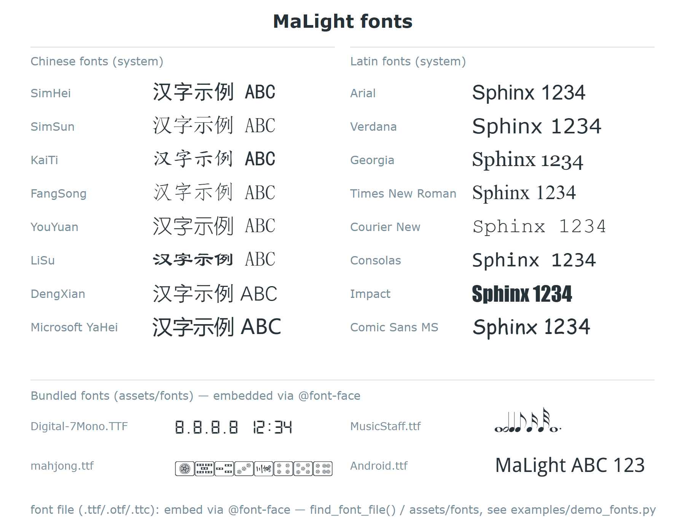

<!-- 本文件由 tools/gen_docs.py 从源码自动生成，请勿手改。
     要改内容请改同目录的 fonts.py 里的文档字符串，然后重跑生成器。 -->

# fonts.py

**简体中文** ｜ [English](fonts.en.md) ｜ [← 返回 README](../README.md)

字体（fonts）—— 字体枚举 Font + 字体解析/查找/内嵌工具

英文版 malight 的字体统一入口，对应中文版《神笔码靓》的 `系统字体`，
并在其基础上增加了「字体文件内嵌」能力。

**三种写法随你方便，可混用**

```text
from malight import Malight, Font

pen = Malight("demo", width=600, height=400)

# 1) 枚举（推荐：IDE 有自动补全，拼错立刻报错，不用记字体名）
pen.text(300, 60,  "黑体标题", font=Font.SIMHEI, font_size=32)

# 2) 字体名（字符串，适合任意已安装字体）
pen.text(300, 120, "微软雅黑", font="Microsoft YaHei", font_size=28)

# 3) 字体文件（.ttf/.otf/.ttc/.woff —— 自动 base64 内嵌进 SVG，
#    换电脑/发给别人也不会掉字体，导出 PDF/PNG 效果一致）
pen.text(300, 180, "楷体", font=r"C:\Windows\Fonts\simkai.ttf", font_size=28)
```

为什么推荐用枚举：字体名写错时浏览器只会「静默回退成默认字体」，
不报错、很难查；用枚举有补全提示、拼错即报错。

常用辅助

```text
Font.SIMHEI.value             # "SimHei"     取字体名
Font.of("SimHei")             # Font.SIMHEI  字符串 -> 枚举
Font.list_names()             # 全部枚举名的列表
Font.is_font_file("a.ttf")    # True         判断是不是字体文件
Font.family_of("c:/a.ttf")    # "a"          从文件猜字体族名
find_font_file("KaiTi")       # 字体文件完整路径（找不到返回 None）
```

**字体文件目录约定** `assets/fonts`：把 `.ttf` / `.otf` / `.ttc` 放进
包内 `malight/assets/fonts/`（随包分发）或项目的 `<项目>/assets/fonts/`，
:func:`find_font_file` 会**优先**在这里找，其次才是系统字体目录；
也可以用环境变量 `MALIGHT_FONTS` 指定更多目录（`;` 分隔）。
资源目录统一用 :func:`malight.asset_path` / :func:`malight.asset_dir` 查找。



---

## 类与方法

### 函数

| 函数 | 说明 |
|---|---|
| `font_face_css` | 生成字体文件的内嵌 @font-face CSS（把字体 base64 塞进 SVG）。 |
| `subset_font` | 按实际用到的文字对字体文件做子集化（需要 fontTools），大幅减小内嵌体积。 |
| `font_search_dirs` | 字体文件的搜索目录（按优先级，系统字体目录之前）。 |
| `find_font_file` | 在字体目录中查找字体文件（对应中文版 `字体查找器` 的简化版）。 |

### `Font`

系统字体枚举（对应中文版 `系统字体`）。成员值即 SVG 的 font-family 名。

| 方法 | 说明 |
|---|---|
| `of(value)` | 把「字体枚举名 / 字体族名」字符串转换为枚举成员。 |
| `is_font_file(value)` | 判断传入的是不是「字体文件路径」（而不是字体族名）。 |
| `family_of(font_file)` | 从字体文件推断「字体族名」（用于生成 @font-face 的 family）。 |
| `list_names()` | 列出全部字体枚举名（便于做字体选择器）。 |
| `list_values()` | 列出全部字体枚举值（字体名）。 |
| `chinese_name(font_value)` | 兼容旧版 `SystemFont.chinese_name`：返回字体对应的枚举名。 |

---

## 完整示例

在 PyCharm 里点绿色三角直接运行，或命令行：`python malight/fonts.py`

```python
if __name__ == "__main__":
    # 相对导入需要包上下文，这里补上（正常 import malight.fonts 时不执行）
    import sys as _sys
    _sys.path.insert(0, os.path.dirname(os.path.dirname(os.path.abspath(__file__))))

    # --- 1) 纯枚举信息，不依赖绘图板 ---
    print("=== 字体枚举 ===")
    print("枚举成员数：", len(Font.list_names()))
    print("Font.SIMHEI       ->", repr(Font.SIMHEI.value))          # 'SimHei'
    print("Font.of('KaiTi') ->", Font.of("KaiTi"))                  # Font.KAITI
    print("Font.of('KAITI') ->", Font.of("KAITI"))                  # Font.KAITI
    print("是字体文件吗：", Font.is_font_file("a.ttf"),
          Font.is_font_file("KaiTi"))                              # True False

    # --- 2) 查找本机字体文件 ---
    print("\n=== 本机字体查找 ===")
    for fam in ("KaiTi", "Microsoft YaHei", "Arial"):
        print(f"  {fam:18s} -> {find_font_file(fam)}")

    # --- 3) 真正画一张图，演示三种字体写法 ---
    from malight import Malight, Color

    pen = Malight("demo_font", width=640, height=360)
    pen.set_background_color("#fbfbfd")          # 浅色背景，方便看字

    # 写法一：枚举（推荐）
    pen.text(320, 70, "枚举 Font.SIMHEI（黑体）", font=Font.SIMHEI,
             font_size=26, fill_color="#1d3557", h_align="middle")
    # 写法二：字体名字符串（任意已安装字体）
    pen.text(320, 130, "字符串 font='Microsoft YaHei'", font="Microsoft YaHei",
             font_size=24, fill_color="#457b9d", h_align="middle")
    # 写法三：字体文件路径（自动内嵌进 SVG，换电脑不掉字体）
    kai = find_font_file(Font.KAITI)
    if kai:
        pen.text(320, 190, "字体文件（已 base64 内嵌）", font=kai,
                 font_size=24, fill_color="#e63946", h_align="middle")
    else:
        pen.text(320, 190, "本机未找到楷体文件，跳过示例", font_size=20,
                 fill_color="#e63946", h_align="middle")
    # 西文枚举 + 加粗
    pen.text(320, 260, "ABJ malight 1234", font=Font.ARIAL, font_size=30,
             bold=True, fill_color="#2a9d8f", h_align="middle")

    pen.finish()      # 保存 SVG（finish 会打印保存全路径）
```

---

## 同级模块

[compat](compat.zh.md) ｜ [definitions](definitions.zh.md) ｜ [ext](ext.zh.md) ｜ [gradients](gradients.zh.md) ｜ [i18n](i18n.zh.md) ｜ [page](page.zh.md) ｜ [svg_backend](svg_backend.zh.md) ｜ [tools](tools.zh.md)
